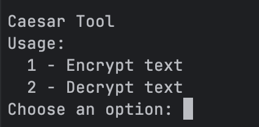
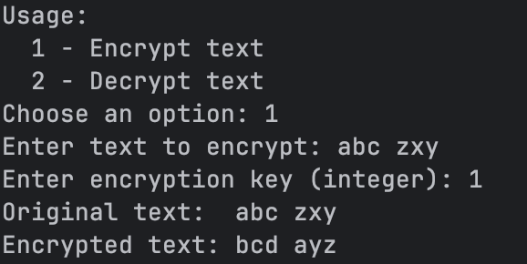
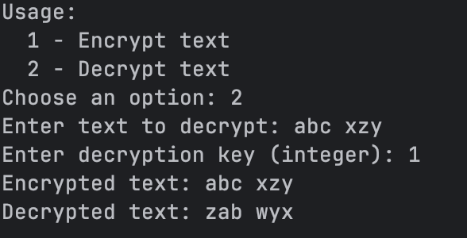
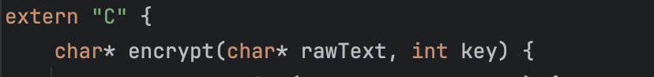
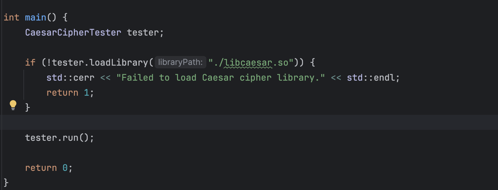

Info about my work

1) Caesar encrypt/decrypt
We have implemented fuctions for Caesar algorithm.
   key = key % 26 - we have sure our char between 0-25 whats corespnding english letters.
  Than we have a script for decoding: 
encryptedText[i] = ((c - base + key) % 26) + base;
c - our current letter
base -is a starting point of the alpahbet we are working with.
key - amount of shifting letters

Let's try our code
Our interface:

Encrypt fucntionallity:

Decrypt fucntionallity:

2) Dynamic link library or Dll - is a shared library in Microsoft or OS
   On Windows, dynamic libraries are .dll (Dynamic-Link Library).
   On Linux/macOS, they are .so (Shared Object)

The DLL is the compiled output of the Caesar functions using -shared — it’s named libcaesar.so.

Dynamic Library code:

how start our project?
g++ -fPIC -c caesar.cpp -o caesar.o
g++ -shared -o libcaesar.so caesar.o
g++ -c main.cpp -o main.o  
g++ -o caesar_test main.o -ldl
./caesar_test
